# obs-midi-viz

> Real-time MIDI visualizer plugin for OBS Studio — piano roll, drum pads, CC lanes, DJ controller skins, and synthesizer patch displays as independent, composable OBS sources.

[](https://github.com/grioghar/obs-midi-viz/actions/workflows/build.yml)

---

## Sources

| OBS Source | What it shows |
|---|---|
| **Keys (MIDI)** | Full 128-key piano roll with velocity-coloured keys; up to 4 independent MIDI controllers, each with its own colour, blending onto a single roll; Synthesia-style falling-note waterfall that fills the canvas with a configurable keyboard height strip at the bottom |
| **Drums (MIDI)** | Pad grid (any size up to 8×8) with velocity-scaled flash decay; 25 device presets (TR-808, MPC 3000, Maschine, Launchpad, and more); three pad styles (Square, Rounded, Circle); GM drum name labels drawn with a GPU-side 3×5 bitmap font |
| **CC Lanes (MIDI)** | Per-CC vertical bars with configurable smoothing for mod wheel, expression, sustain, filter, and any other CC number |
| **DJ Controller (MIDI)** | Two-deck Pioneer DDJ-FLX4 (and compatible AlphaTheta controllers) top-down schematic with live-animated jog wheels, 27-dot LED-arc rotary knobs (EQ Hi/Mid/Lo, Trim, Filter), vertical channel faders, horizontal crossfader, loop buttons (Loop In / Reloop / Loop Out), pad mode selector (Hot Cue / Beat Loop / Beat Jump / Sampler), and 8 performance pads per deck; every control driven directly from MIDI CC and Note data using the official DDJ-FLX4 MIDI message specification |
| **Synth Patch Display (MIDI)** | Full synth parameter panel populated live from MIDI SysEx patch dumps; panels for Behringer DeepMind 12, Korg DSS-1, Alesis QS7.1, and Yamaha PSR-540; sections for VCOs/DCOs, filter, envelopes (ADSR visualizer), LFOs, and FX; real-time CC updates for filter cutoff/resonance; multiple independent instances supported |
| **Ableton Live (Session View)** | Live session grid showing scenes × tracks with clip status (empty / has clip / playing), per-track stereo level meters with peak-hold, and a transport HUD (BPM, bar/beat position, play state); data received over OSC from the free [AbletonOSC](https://github.com/ideoforms/AbletonOSC) Max for Live device |
| **Waveform (Audio)** | Real-time rolling stereo waveform that taps OBS's own mixed audio output — no external library or device picker needed; works with any audio OBS is mixing (Rekordbox via virtual cable, Ableton, Desktop Audio, microphones); L channel above centre, R below; amplitude-based colour gradient (green → amber → red); configurable time window (0.5 – 8 s) |

All sources are independent — add, resize, reorder, and show/hide them per scene.

---

## Previews

### Keys (MIDI) — piano roll with waterfall, two controllers blending

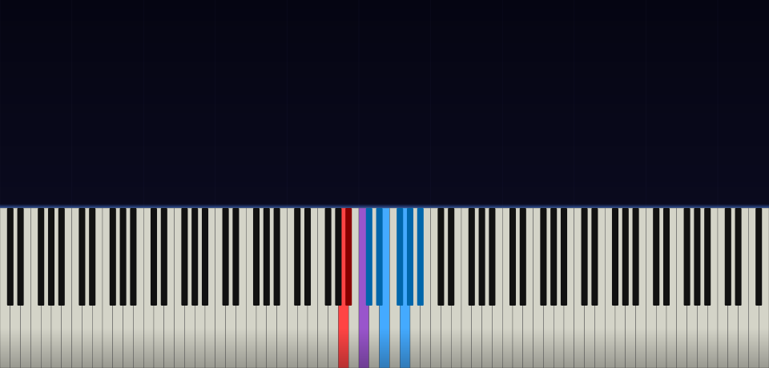

*Blue = controller 1 (C-major chord); red = controller 2 (A-minor); purple blend where both play the same note (C4).*

### Drums (MIDI) — Roland TR-808 preset

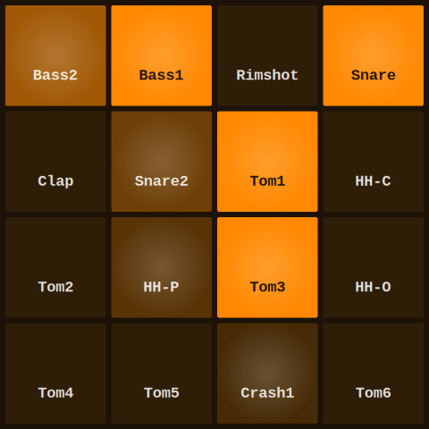

*Warm orange hits on near-black wood-panel background. Bass1, Snare, Tom1, and Tom3 are currently triggered.*

### Drums (MIDI) — Novation Launchpad X preset

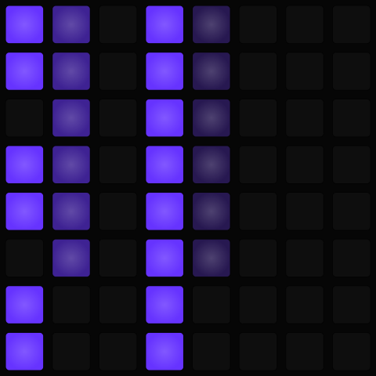

*8×8 rounded pads, purple RGB hits — matching the Launchpad X's native aesthetic.*

### Drums (MIDI) — NI Maschine Studio preset

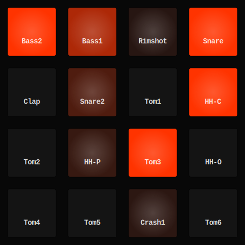

*4×4 rounded pads, deep red hits on near-black panel.*

### CC Lanes (MIDI)

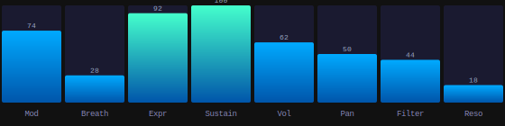

*8 CC lanes (Mod, Breath, Expr, Sustain, Vol, Pan, Filter, Reso) at current values. Sustain (100%) glows cyan; low values render in standard blue.*

### Drums (MIDI) — Roland TR-808 step-sequencer view

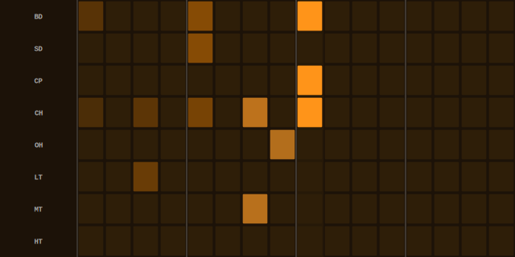

*Instruments as rows (BD / SD / CP / CH / OH / LT / MT / HT), 16 time steps as columns. The highlighted column (step 9) just fired BD + CP + CH simultaneously. Steps 1–8 show decayed orange traces; steps 10–16 are dark (not yet played this bar). Thin lines separate the four 4-step groups.*

### Drums (MIDI) — Roland TB-303 bassline step-sequencer view

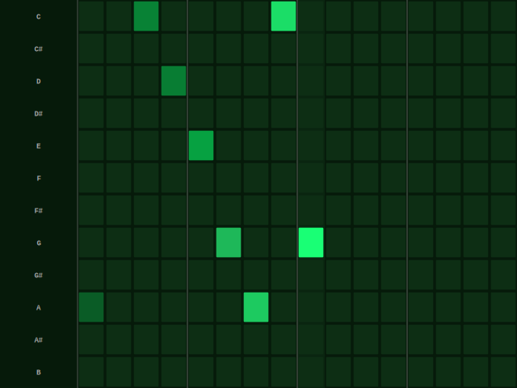

*12-row chromatic pitch-class display (C through B). Any octave of a note fires the same row — here an A-minor acid figure has built up a scrolling green pattern. Step 9 fired a G (row 7 fully lit); earlier steps show the A → C → D → E → G → A → C ascent fading to the left. Steps 10–16 are idle.*

### DJ Controller (MIDI) — Pioneer DDJ-FLX4 layout

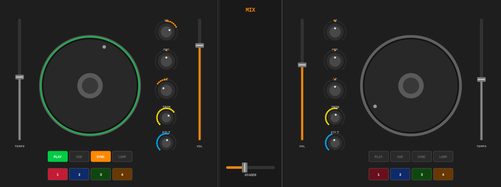

*Deck 1 (left) is playing — green ring glows around the spinning jog wheel, PLAY and SYNC are lit. EQ High is boosted (arc lights above centre), Low is rolled off. Loop In / Reloop / Loop Out buttons sit below the jog wheel. Hot Cue 1 just fired (pad flash) in the 2×4 pad grid. Pad mode selector (HC / LOOP / JUMP / SAMP) shows the active mode. Deck 2 (right) is cued and ready with neutral EQ; crossfader sits toward Deck 1. All MIDI CC and Note numbers match the official Pioneer DDJ-FLX4 MIDI Message Specification.*

### Synth Patch Display (MIDI) — Behringer DeepMind 12

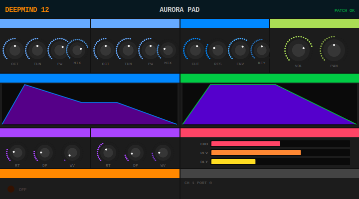

*"AURORA PAD" patch: VCO1 and VCO2 sections show 27-dot LED-arc knobs for octave, tuning, pulse width, and mix level. Filter section (blue) shows cutoff at 58 %, medium resonance, high envelope amount. Filter ENV (left) and Amp ENV (right) display ADSR shapes — the amp envelope has a near-zero decay and full sustain, giving the pad its characteristic hold. LFO1 and LFO2 run at slow rates with subtle depth. FX section shows Chorus at 50 %, Reverb at 65 %, and a touch of Delay. All values populate from a SysEx patch dump; filter cutoff and resonance also update live from CC 74 / 71.*

### Ableton Live (Session View)

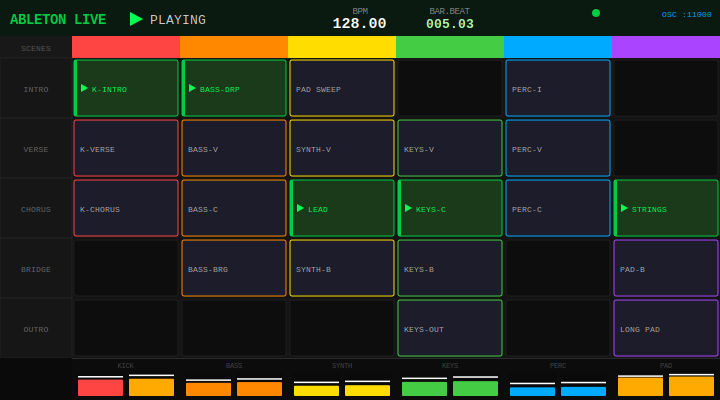

*Six tracks (KICK / BASS / SYNTH / KEYS / PERC / PAD) × five scenes (INTRO / VERSE / CHORUS / BRIDGE / OUTRO). The CHORUS scene is currently playing — actively-playing clips glow bright green with a play stripe; clips that exist but are not playing show a coloured border; empty slots are dark. The transport HUD (top) shows 128.00 BPM, bar/beat position, and OSC port. Per-track stereo level meters with peak-hold hairlines run along the bottom of each column. Data is received live over OSC from the free AbletonOSC Max for Live device.*

### Waveform (Audio)

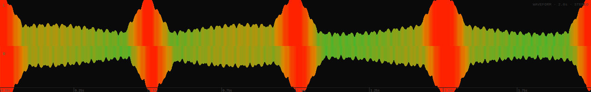

*Two seconds of stereo audio from OBS's primary mix. L channel (above the centre line) and R channel (below) each fill toward the centre with amplitude-based colour: green for quiet passages, amber for moderate levels, red for loud transients. The four kick-drum peaks are clearly visible as red spikes at the quarter-note positions. The horizontal rule at the bottom shows a 0 – 2 s time scale. This source requires no device configuration — it automatically taps whatever OBS is mixing and sending to the encoder.*

---

## Installation

Download the latest build artifacts from the [Actions tab](https://github.com/grioghar/obs-midi-viz/actions) (click the most recent green run → **Artifacts**).

| Platform | File | Install path |
|---|---|---|
| **Windows** | `obs-midi-viz-windows-x64.zip` | Extract into `%ProgramFiles%\obs-studio\` (so `obs-plugins\64bit\obs-midi-viz.dll` lands in the right place) |
| **macOS (Apple Silicon)** | `obs-midi-viz-macos-arm64.tar.gz` | Extract, then copy `obs-midi-viz.plugin` → `~/Library/Application Support/obs-studio/plugins/` |
| **Linux (x86-64)** | `obs-midi-viz-linux-x86_64.tar.gz` | Extract, then copy `obs-midi-viz/` → `~/.config/obs-studio/plugins/` |

Restart OBS, then add sources via **+** → **Keys (MIDI)** / **Drums (MIDI)** / **CC Lanes (MIDI)** / **DJ Controller (MIDI)** / **Synth Patch Display (MIDI)** / **Ableton Live (Session View)** / **Waveform (Audio)**.

---

## macOS: Gatekeeper & quarantine

### Why OBS won't load the plugin out of the box

macOS Gatekeeper automatically quarantines every file downloaded from the internet. A quarantined `.plugin` bundle is blocked from loading — OBS will silently skip it, and no source types will appear. This is **not** a bug in the plugin; it is standard macOS security behaviour for unsigned third-party code.

### Quick fix (one-time terminal command)

After copying the bundle to your plugins folder, run:

```bash
xattr -dr com.apple.quarantine \
  ~/Library/Application\ Support/obs-studio/plugins/obs-midi-viz.plugin
```

`-d` removes the attribute, `-r` recurses into the bundle's subdirectories. You only need to do this once per install.

Verify it worked — the following should print nothing:

```bash
xattr ~/Library/Application\ Support/obs-studio/plugins/obs-midi-viz.plugin
```

### Permanent fix — Apple code signing + notarization

The root cause is that the plugin is not signed with an Apple-issued certificate. Until it is, every user who downloads it must run `xattr` manually. To remove that requirement permanently:

| Step | What it involves | Cost |
|---|---|---|
| **Apple Developer account** | Required to obtain any Apple-issued signing certificate | $99 / year |
| **Developer ID Application certificate** | The specific certificate type needed for software distributed outside the Mac App Store | Included with membership |
| **Code-sign the bundle** | `codesign --sign "Developer ID Application: …" --deep --force --options runtime obs-midi-viz.plugin` | Free once enrolled |
| **Notarize with Apple** | Submit the signed bundle to Apple's notarization service via `xcrun notarytool submit`; Apple scans for malware and returns a ticket | Free (a few minutes per submission) |
| **Staple the ticket** | `xcrun stapler staple obs-midi-viz.plugin` — embeds the notarization result so macOS can verify offline | Free |

Once signed, notarized, and stapled, macOS will trust the plugin on any machine without requiring `xattr`. The CI workflow can be updated to perform all of these steps automatically using secrets for the certificate and notarization credentials — let me know when you have a Developer ID certificate and I'll add that to the GitHub Actions build.

---

## Drum Machine Device Presets

Pick a preset from the **Device Preset** dropdown in the source properties.
It auto-fills the grid size, base note, colours, and pad style — you can then
fine-tune any individual field.

Presets marked **(Step Seq)** use the **step-sequencer layout**: instruments as
rows, 16 time steps as columns. The other presets use the standard **pad grid** layout.

### Roland

| Preset | Layout | Grid / Rows | Pad Style | Notable use |
|---|---|---|---|---|
| Roland TR-808 | Pad grid | 4×4 | Square | Trap, hip-hop, 808 bass |
| Roland TR-808 (Step Seq) | Step seq | 8 rows × 16 steps | — | BD/SD/CP/CH/OH/LT/MT/HT |
| Roland TR-909 | Pad grid | 4×4 | Square | House, techno |
| Roland TR-909 (Step Seq) | Step seq | 8 rows × 16 steps | — | BD/SD/RM/CP/CH/OH/LT/HT |
| Roland TR-707 | Pad grid | 4×4 | Square | Pop, early electronic |
| Roland TR-707 (Step Seq) | Step seq | 8 rows × 16 steps | — | BD/SD/RM/CH/OH/LT/MT/CY |
| Roland TR-606 | Pad grid | 2×3 | Square | Acid, TB-303 companion |
| Roland SP-404 | Pad grid | 4×4 | Square | Lo-fi, beat tapes |
| Roland TB-303 (Bassline) | Step seq | 12 rows × 16 steps | — | Chromatic pitch-class acid bass |

### Akai MPC

| Preset | Grid | Pad Style | Notable use |
|---|---|---|---|
| Akai MPC 60 | 4×4 | Rounded | Golden-era hip-hop (Roger Linn design) |
| Akai MPC 3000 | 4×4 | Rounded | Dre, Premier, J Dilla |
| Akai MPC Live | 4×4 | Rounded | Modern standalone production |

### Native Instruments Maschine

| Preset | Grid | Pad Style | Notes |
|---|---|---|---|
| NI Maschine Studio | 4×4 | Rounded | Flagship; dual-display body |
| NI Maschine Mk3 | 4×4 | Rounded | Current standard |
| NI Maschine Mikro | 4×4 | Rounded | Compact |

### Hip-Hop Heritage

| Preset | Grid | Pad Style | Notable use |
|---|---|---|---|
| E-mu SP-1200 | 4×2 | Square | Golden-age NY hip-hop; punchy filtered drums |
| Oberheim DMX | 4×2 | Square | Run-DMC, LL Cool J |
| LinnDrum | 4×2 | Square | Prince, Human League |

### Elektron

| Preset | Grid | Pad Style | Notes |
|---|---|---|---|
| Elektron Digitakt | 4×4 | Square | Digital sampler/sequencer |
| Elektron Analog Rytm | 4×3 | Square | Analog + acoustic, 12 voices |

### Novation Launchpad

| Preset | Grid | Pad Style | Notes |
|---|---|---|---|
| Novation Launchpad | 8×8 | Square | Original; green pads; live clip launching |
| Novation Launchpad Mini | 8×8 | Square | Compact |
| Novation Launchpad X | 8×8 | Rounded | RGB velocity-sensitive |
| Novation Launchpad Pro | 8×8 | Rounded | RGB + aftertouch |

### Arturia & Korg

| Preset | Grid | Pad Style | Notes |
|---|---|---|---|
| Arturia BeatStep Pro | 8×2 | Circle | 16-step sequencer rows |
| Arturia DrumBrute | 4×4 | Circle | Analog drum synth |
| Korg Volca Beats | 4×4 | Circle | Lo-fi analog; yellow accent |

---

## Multi-Controller Piano Roll

The **Keys (MIDI)** source supports up to **4 simultaneous MIDI controllers**, each
assigned its own colour. Notes from different controllers blend on the same
keyboard and waterfall — useful for showing two players on separate keyboards,
or layering a keyboard with a pad controller.

Properties: **Slot 0–3 Port** and **Slot 0–3 Colour**.

---

## Building from source

### Prerequisites

**All platforms**
- CMake 3.24+
- A C++17 compiler (MSVC 2022 / Clang / GCC)
- OBS Studio (for headers and `libobs`)
- Internet access for the first build (RtMidi is fetched via `FetchContent`)

**Windows**
```
Visual Studio 2022 with "Desktop development with C++" workload
```

**macOS**
```
brew install cmake ninja
Xcode Command Line Tools  (xcode-select --install)
OBS Studio installed to /Applications/
```

**Linux (Ubuntu 22.04)**
```
sudo add-apt-repository ppa:obsproject/obs-studio
sudo apt update
sudo apt install cmake ninja-build libobs-dev libasound2-dev
```

### Build

```bash
git clone https://github.com/grioghar/obs-midi-viz.git
cd obs-midi-viz

cmake -B build -DCMAKE_BUILD_TYPE=RelWithDebInfo
cmake --build build --parallel
cmake --install build --prefix dist
```

The `dist/` directory will contain the platform-appropriate layout ready to copy into OBS.

---

## Project structure

```
obs-midi-viz/
├── .github/workflows/build.yml     # CI matrix: Linux / macOS / Windows
├── docs/
│   ├── images/                     # SVG mockup images used in this README
│   └── render/                     # gen-mockups.ps1 — regenerate the images
├── src/
│   ├── plugin-main.cpp             # obs_module_load — registers all sources
│   ├── plugin-support.h            # Logging macros (MIDI_LOG_INFO / ERR)
│   ├── midi-engine.hpp/.cpp        # Thread-safe RtMidi wrapper + event queue
│   ├── osc-receiver.hpp/.cpp       # UDP OSC listener engine (background thread)
│   └── sources/
│       ├── piano-source.*          # Keys (MIDI) — piano roll + waterfall
│       ├── drum-source.*           # Drums (MIDI) — pad grid + device presets
│       ├── cc-source.*             # CC Lanes (MIDI) — bar graph
│       ├── dj-source.*             # DJ Controller (MIDI) — DDJ-FLX4 skin
│       ├── synth-source.*          # Synth Patch Display (MIDI) — 4-model panels
│       ├── daw-source.*            # Ableton Live (Session View) — OSC bridge
│       └── waveform-source.*       # Waveform (Audio) — rolling PCM waveform
└── data/locale/en-US.ini           # OBS Properties panel strings
```

---

## Development roadmap

### Phase 1 — Scaffolding ✅
CMake project, GitHub Actions CI (Linux / macOS / Windows), hello-world OBS sources.

### Phase 2 — MIDI engine ✅
RtMidi integration; thread-safe event queue; multi-port support (one `RtMidiIn`
per device, all open simultaneously); MIDI device selector in every source.

### Phase 3 — Piano Roll renderer ✅
- White/black key drawing with velocity-coloured flash and decay
- Up to 4 simultaneous MIDI controllers with per-controller colours, blending onto a single roll
- Synthesia-style falling-note waterfall; configurable keyboard height so the roll can fill any canvas size

### Phase 4 — Drum Pad renderer ✅ (ongoing)

#### 4a — Core grid renderer ✅
GPU-side pad grid with velocity flash; 3×5 bitmap font labels (GM drum names or note numbers); proportional gaps; luminance-adaptive text colour.

#### 4b — Device preset system ✅
29 presets across Roland, Akai MPC, NI Maschine, Novation Launchpad, Elektron,
Arturia, Korg, and hip-hop heritage machines (SP-1200, Oberheim DMX, LinnDrum).
Three pad styles: Square, Rounded, Circle. Separate panel/idle/hit colours per preset.
Selecting a preset auto-fills all grid and colour properties.

#### 4c — Authentic step-sequencer layouts ✅
TR-808, TR-909, and TR-707 in their native **16-step row-per-instrument** view —
instruments as horizontal rows (BD, SD, CP, CH, OH, LT, MT, HT), time steps as
columns; a current-step highlight band scrolls right as notes arrive; group
separator lines mark every 4 steps (one bar).

**Roland TB-303 (Transistor Bass / Bassline)** — 12-row chromatic pitch-class view:
each row is one semitone (C through B), any octave of that pitch fires the same row.
Acid basslines build up a scrolling chromatic pattern in the signature TB-303 green.

Step-seq presets appear in the Device Preset dropdown alongside the existing pad-grid
presets (e.g. "Roland TR-808 (Step Seq)").

Still to come: Launchpad auxiliary button rows; LaunchControl XL knob rings.

#### 4d — DJ controller skins ✅

Graphically accurate top-down schematic of a 2-deck DJ controller, every
physical control animated in real time from MIDI data — no polling, no
approximation.

**Implemented: Pioneer DJ DDJ-FLX4** (and compatible AlphaTheta 2-deck controllers)

| Control | How it works | MIDI (FLX4) |
|---|---|---|
| EQ Hi / Mid / Low (per channel) | CC value → 27-dot LED arc (centre-detent) | CC 7 / 11 / 15 MSB, ch 1–2 |
| Gain / Trim | CC → 27-dot LED arc (sweep from zero) | CC 4 MSB, ch 1–2 |
| Filter knob (per channel) | CC → 27-dot LED arc | CC 23 / 24, ch 7 |
| Channel faders (×2) | CC → vertical slider with lit fill track | CC 19 MSB, ch 1–2 |
| Crossfader | CC → horizontal slider with lit fill | CC 31, ch 7 |
| Jog wheels (×2) | Relative CC accumulates → spinning platter disc with marker dot | CC 34 / 35, ch 1–2 |
| Play / Cue / Beat Sync | Note state → button illuminates in themed colour | Notes 11 / 12 / 88, ch 1–2 |
| Loop In / Reloop / Loop Out | Note state → button illuminates | Notes 16 / 77 / 17, ch 1–2 |
| Pad mode selector (HC/LOOP/JUMP/SAMP) | Note On → mode button lights; pad grid recolours | Notes 27 / 109 / 32 / 34, ch 1–2 |
| Performance pads (×8 per deck) | Note On → pad flashes to full colour; decays 8 ×/s | Notes 0–7, ch 8 (deck 1) / ch 10 (deck 2) |

All CC and Note numbers match the official **Pioneer DDJ-FLX4 MIDI Message Specification** and have been verified against the Mixxx DDJ-FLX4 hardware mapping.

**Canvas** 1280 × 480 (configurable). **MIDI channels** configurable per deck
(defaults: Deck 1 = Ch 1, Deck 2 = Ch 2, Mixer = Ch 7).

**What MIDI alone cannot deliver** (reserved for Phase 7 — DAW Integration):
audio waveforms, track titles, playhead position, beat-grid alignment.

Additional targets: DDJ-400, DDJ-REV5, Denon SC Live series, Rane Seventy-Two.

### Phase 5 — CC Lanes renderer ✅
Vertical bar graph per CC lane with exponential smoothing, numeric value overlay
(MIDI 0–127), configurable CC assignments, peak-hold indicator with 1.5 s hold
then gravity decay, and a two-tone gradient fill that shifts hot (orange → red)
when a lane exceeds 88 % of its range. Up to 8 lanes; tick marks at 25 / 50 / 75 %.

### Phase 6 — Synthesizer Patch Displays ✅ (initial release)

Per-synthesizer panel that reads live parameter state via MIDI SysEx patch
dumps and renders knobs, envelope shapes, and FX bars as a single GPU-composited
OBS source. Multiple independent instances are supported — one per synth in your
rig, each on its own MIDI port and channel.

**Source: Synth Patch Display (MIDI)** — select model in Properties:

| Model | SysEx header | Panel sections |
|---|---|---|
| **Behringer DeepMind 12** | `F0 00 20 32 28 xx 01` | VCO1, VCO2, Filter, Amp, Filter ENV, Amp ENV, LFO1, LFO2, FX, Arp |
| **Korg DSS-1** | `F0 42 [0x30\|ch] 02 40` | SOURCE (sample/waveform), VDF (filter), VDA (amp), EG1 (filter ENV), EG2 (amp ENV), LFO |
| **Alesis QS7.1** | `F0 00 00 0E xx` | 4 Elements each with Level, Filter, Amp ENV, Mod ENV, LFO; FX levels |
| **Yamaha PSR-540** | `F0 43 xx` | Master Vol/Pan, Tempo, Reverb, Chorus, Harmony, Voice bar |

Each panel renders **immediately** with demo defaults; parameters update once
a SysEx bulk dump is received from the hardware (see Properties panel for
per-model dump instructions). Filter cutoff (CC 74) and resonance (CC 71) also
update live without a full dump.

SysEx accumulation is handled by an extended `MidiEvent::raw` field added to
the engine in v0.1.6.0 — the full byte vector is captured for every SysEx
message and dispatched to subscribers alongside normal CC/Note events.

Future additions: Roland JD-Xi, Korg Minilogue XD, Sequential Prophet-5,
Arturia MiniFreak (all publish MIDI SysEx specs). Software synths (Serum,
Vital) will be handled via the AbletonOSC / VST parameter bridge in Phase 8.

### Phase 7 — DAW Integration ✅ (initial release)

Bidirectional state bridge between obs-midi-viz and host DAW software.
Rather than reacting only to raw MIDI bytes, Phase 7 lets the plugin read
rich session state — clip names, track levels, scene names, playhead
position — and reflect it in OBS sources.

**Delivered in v0.1.7.0:**

- New engine class `OscReceiver` (`src/osc-receiver.*`): background UDP thread,
  zero-dependency OSC packet parser, thread-safe event queue drained each
  `video_tick`; sources subscribe via the same callback pattern as MIDI.
- Outbound OSC queries via `OscReceiver::send()` — clip/track metadata fetched
  automatically on source load and refreshed periodically.
- New OBS source: **Ableton Live (Session View)** (`src/sources/daw-source.*`) —
  live scene × track grid, per-track stereo level meters with peak-hold,
  transport HUD (BPM, bar/beat, play state).

**AbletonOSC setup (one-time)**
1. Download [AbletonOSC](https://github.com/ideoforms/AbletonOSC) and drop it
   into your Ableton Live User Library as a Max for Live MIDI device.
2. Drag it onto any MIDI track; the device listens on UDP port **11000** by default.
3. In the OBS source properties, set **OSC Port** to match (default 11000) and
   click OK — the source begins polling immediately.

**Still to come in Phase 7**
- [Ableton Link](https://ableton.github.io/link/) transport sync (phase-locked
  BPM across the LAN, replacing unreliable MIDI Clock).
- Software-synth parameter streams via AbletonOSC VST bridge (Serum, Vital).
- Rekordbox OSC export (beat/BPM/key); ProDJ Link waveform + metadata via
  [dysentery](https://github.com/Deep-Symmetry/dysentery).

### Phase 8 — Waveform & Polish ✅ / 🚧

#### 8a — Waveform (Audio) source ✅

Real-time rolling stereo waveform that taps OBS's own primary output mix via
`audio_output_connect()`. No external audio library; no device picker; works
with any audio OBS is mixing.

| Property | Description | Default |
|---|---|---|
| Canvas width / height | Source dimensions | 1280 × 200 |
| Time window | Seconds of audio history displayed | 2.0 s |
| Display mode | Stereo (L / R separate) or Mono (L+R averaged, mirrored) | Stereo |
| Color — Low / Mid / High | Gradient stops at 0 % / 60 % / 100 % amplitude | green / amber / red |
| Background Color | Canvas background | near-black |
| Show centre line | Faint horizontal divider between L and R channels | on |

**Why this approach beats Rekordbox or Ableton waveform extraction:**
Rekordbox's beautiful analyzed waveform (the purple/blue CDJ display) requires
ProDJ Link — a reverse-engineered network protocol where your machine joins the
network as a "virtual CDJ." Complex, brittle, and requires Rekordbox export
mode with CDJs on the LAN. AbletonOSC provides no raw audio or rendered
waveforms at all. Tapping OBS's mix is universal and zero-configuration.

**Rekordbox analyzed waveform** (the per-track beat-grid/colour waveform) is
still planned via the ProDJ Link path in Phase 7 "still to come."

#### 8b — Polish 🔜
CPack installers (NSIS for Windows, macOS pkg/dmg, Linux .deb); OBS source icons;
code signing + notarization for macOS (eliminates xattr requirement);
per-scene preset save/restore; MIDI channel filtering.

---

## TODO / Future Ideas

Ideas queued for future development. These are not yet scheduled — they are collected here so nothing gets lost.

---

### TODO 1 — Drop-in SysEx synthesizer definitions

> *"Modularize the plugin so that all one needs to do to create a new synthesizer is drop in the SysEx for the device in the folder, name it, and create a map to the details."*

**What this means:** Instead of hard-coding each synth model in `synth-source.cpp`, provide a data-driven system where a JSON or YAML file describes the SysEx header, parameter offsets, parameter names, ranges, display types (knob / bar / ADSR / enum), and section groupings. `synth-source.cpp` becomes a generic renderer that loads these files at startup and offers each discovered model in the Properties dropdown.

**Difficulty: Medium–High.**
- The schema design is non-trivial — parameters differ wildly between synths (7-bit, 14-bit, nibble-packed, signed, two-complement, etc.).
- The rendering engine needs to handle all display archetypes generically: LED-arc knobs, bars, ADSR curve shape, waveform-icon enums. Currently these are baked into per-model render functions.
- Parameter layout (section positions, rows, columns) must be expressible without writing code — either a declarative grid spec or a coordinate list.
- The generic renderer will inevitably be slightly less polished than a hand-crafted panel, especially for synths with unusual UI conventions.
- **Feasibility: High** — the payoff is enormous (any synth with a published MIDI SysEx spec becomes a one-hour addition rather than a multi-day implementation). Recommended as a Phase 9 project once the panel count reaches 6–8 and the pattern is fully clear.
- **What you'd need:** A schema-to-renderer pipeline; a small sample set of synth JSON files to validate the schema; a community contribution path (PR a `.synth.json` file → appears in the dropdown automatically).

---

### TODO 2 — MIDI Monitor source / window

> *"A small window that reflects the incoming and outgoing MIDI events — configurable to show all, tab through devices, select which devices, with color-coding and legend."*

**What this means:** A new OBS source (or dockable panel) that renders a scrolling log of MIDI events in real time — Note On/Off, CC, SysEx, Program Change, Clock — with colour-coding by message type and per-device filtering.

**Difficulty: Low–Medium.**
- The MIDI engine already queues all events; the monitor just needs a subscriber that captures every event (all channels, all types) and appends to a ring buffer.
- Rendering a scrolling text list in OBS GPU context requires a fixed-width bitmap font (already present: the 3×5 font in drum-source) or a slightly larger one for readability.
- Per-device tabs add UI complexity (OBS properties list for enabling/disabling devices) but are not architecturally difficult.
- Colour-coding by message type is straightforward; by device requires routing the source-device index alongside each event.
- **Feasibility: High.** This is the fastest win on the TODO list — useful for setup and debugging regardless of which source you're actually building.

---

### TODO 3 — LaunchKey / MPK Mini grid configuration for Drums

> *"Add configuration for controllers like the LaunchKey/MPK Mini series, which have a 2×8 or 2×16 rows and columns, and reflect the configuration without distorting the shape of the buttons."*

**What this means:** Extend the Drums source properties to accept explicit row and column counts, and render pad cells as true squares (or user-specified aspect ratio) regardless of canvas dimensions — so a 2×8 grid on a wide canvas shows 16 wide rectangles, not 16 squashed ones.

**Difficulty: Low.**
- The grid renderer already parameterises rows and columns; the missing piece is a "preserve pad aspect ratio" option that either adds letterbox padding or centres the grid.
- The LaunchKey 25/37/49 pads are 2 rows × 8 columns (16 pads); MPK Mini is 2 × 8. Adding presets for these is a 15-minute property file addition once the aspect constraint is implemented.
- The harder sub-problem is correctly mapping MIDI note numbers for these controllers (LaunchKey notes start at 36 or 40 depending on firmware version) — but that is already handled by the base-note property.
- **Feasibility: High.** Already ~80 % done. Recommend tackling before Phase 8 polish pass.

---

### TODO 4 — Device-accurate skins (visual replicas of real hardware)

> *"Create skin-able containers around the buttons, making the device look just like its real-life counterpart — the TR-808, or the DDJ-FLX4 — instead of representative."*

**What this means:** Replace the current schematic-style graphics with pixel-accurate replicas of the physical device panels — correct colours, faceplate texture, silkscreen labels, and control proportions — so the OBS overlay looks like the real hardware sitting on a desk.

**Difficulty: High.**
- Each device needs a hand-crafted background image (SVG or bitmap) that precisely matches the faceplate geometry.
- Every interactive control must be registered at exact pixel coordinates so the live-state overlay aligns with the background art.
- Maintaining two layers (static background skin + dynamic control state overlay) requires either a compositor step in the OBS source or a pre-composited approach where control "slots" are defined in the skin metadata.
- Licensing the artwork is a concern if photo-realistic: traced SVG representations are generally fine; trademarks (Pioneer logo, Roland logo) on distributed builds need consideration.
- Scaling across different canvas resolutions while keeping controls aligned to the skin requires a proportional coordinate system (normalised 0–1 per faceplate, scaled to output resolution).
- **Feasibility: Achievable** — the architecture needs a "skin layer" concept added to the DJ and Drum sources, and a skin metadata file (JSON) that maps control IDs to skin coordinates. The first skin (TR-808) would prove the system; subsequent skins are data, not code. Estimated effort: 2–3 weeks for the infrastructure + one well-known device skin.

---

### TODO 5 — 3D control objects on a three-axis scene layout

> *"I want to use 3D objects and be able to lay them out in the scene on a 3-way axis. Is this possible?"*

**What this means:** Render hardware controls (knobs, faders, pads) as full 3D objects that can be rotated, tilted, and positioned in 3D space within the OBS scene — giving a perspective/isometric view of the controller rather than a flat top-down schematic.

**Difficulty: Very High — and requires OBS architectural extension.**

OBS Studio's compositing pipeline is fundamentally 2D: sources produce flat RGBA textures, scenes stack them with 2D transforms (translate X/Y, scale, rotate around Z). There is no native scene-level 3D transform or depth buffer.

**What would be required:**
- **Option A (pre-rendered assets):** Render 3D frames offline (Blender, Three.js) at every relevant control state and store them as image sequences or sprite sheets. The OBS source switches frames based on live MIDI data. Gives true 3D appearance with zero runtime 3D overhead. **Feasibility: Medium.** The pre-rendering pipeline is significant work, and animation smoothness is limited by frame count.
- **Option B (runtime 3D renderer):** Embed a lightweight 3D scene graph (e.g. a minimal OpenGL scene using OBS's existing `gs_*` GFX API, which wraps OpenGL/D3D11/Metal). OBS does expose the GFX context inside `obs_source_video_render()` — you can set up projection matrices and draw textured meshes. **Feasibility: High effort, technically possible.** Requires writing a full mesh loader, texture system, and camera/projection setup using OBS GFX primitives — roughly the complexity of writing a small game renderer.
- **Option C (obs-3d-effect plugin pattern):** The community plugin `obs-3d-effect` already adds a per-source 3D transform filter using OpenGL. obs-midi-viz could output its normal 2D texture and rely on that filter for the 3D placement step. Users would compose: *DJ Controller source → obs-3d-effect filter → scene*. **Feasibility: High, zero renderer code.** The limitation is that the 3D filter applies to the whole source texture, not to individual controls.

**Recommendation:** Start with Option C for the layout step (free, already exists) and Option A for individual control objects that benefit most from depth (jog wheels, knobs). Full Option B is a large standalone project — possible, but worth scoping as a separate plugin or a major version milestone.

---

### TODO 6 — Audima Labs Sway air-gesture MIDI controller overlay

> *"Advise on the Audima Labs Sway MIDI controller and what would be needed in creating an overlay that shows where in the air my hand is and the corresponding MIDI event I triggered."*

**What this means:** The [Audima Sway](https://audima.co) is a wearable theremin-style controller that translates hand position and gesture in 3D space into MIDI CC and Note messages. The overlay would show a visualisation of the current 3D hand position alongside the MIDI event it produced.

**What the Sway sends (based on published Audima MIDI mapping):**
- X axis → CC (horizontal position, typically CC 1 or user-mapped)
- Y axis → CC (vertical position / pitch, typically CC 11 or velocity)
- Z axis → CC (depth / proximity)
- Gesture triggers → Note On/Off events on configured pitches

**What the overlay needs:**
- A 3D coordinate read from three CC values (X/Y/Z axes) — straightforward once you know which CCs the device is mapped to (configurable in Properties).
- A visual representation of the hand position: at minimum a cursor dot in a 2D projection (top-down or front-facing); ideally a 3-axis crosshair or a ghost-hand skeleton. The 2D projection is low difficulty; skeleton rendering is medium.
- Triggered event annotation: the note or CC name that just fired, displayed near the cursor with flash-decay — same mechanism as the existing hot-cue pad flash.

**Difficulty: Medium** (once the device is in hand and the CC mapping is confirmed).
- The hard part is choosing a good visual metaphor for a 3D position displayed on a 2D OBS canvas.
- A simple approach: two side-by-side 2D views (X/Y front view, X/Z top view) with a dot tracking the cursor — readable and implementable in a day once CCs are confirmed.
- A richer approach: a single perspective-projected 3D volume with the cursor rendered in depth — requires the 3D infrastructure from TODO 5.
- **Recommendation:** Implement the simple twin-2D-view version first (fast, clear, works today); revisit with the 3D renderer from TODO 5 once that is built.

---

### TODO 7 — Rock Band Xbox 360 drum kit preset (top-down view)

> *"I have a set of Harmonix Rock Band Xbox 360 drums connected to MIDI. Under 'Drums' I'd like a configuration that looks like the Rock Band drums from the top down, with kick pedal, and the ability to name each pad/kick and provide the corresponding MIDI notes."*

**What this means:** A new device preset in the Drums source that shows the Rock Band drum kit in a recognisable top-down schematic: four colour-coded drum pads (green, red, yellow, blue) arranged in a roughly semicircular arc, a kick pedal indicator below, and optional custom labels and MIDI note assignment per pad/kick.

**Rock Band Xbox 360 drum kit MIDI notes (standard Harmonix mapping):**
| Pad | Colour | Default MIDI Note |
|---|---|---|
| Bass drum (kick pedal) | — | 33 |
| Snare (red pad) | Red | 38 |
| Hi-hat (yellow pad) | Yellow | 42 |
| Low tom (blue pad) | Blue | 45 |
| Crash/Floor tom (green pad) | Green | 49 |

*(Exact notes may vary by adapter; the Properties panel will let you reassign each.)*

**Difficulty: Low–Medium.**
- The drum renderer already handles arbitrary pad grids; the Rock Band layout just needs a non-rectangular geometry — four pads in an arc plus a kick bar below, rather than a grid.
- The current renderer assumes a uniform rows × columns grid. Supporting irregular layouts (arc, T-shape, kick-bar-at-bottom) requires either: (a) a "custom pad positions" mode where each pad has explicit normalised coordinates, or (b) a dedicated Rock Band render path alongside the existing grid path.
- Option (b) is faster to ship; option (a) unlocks all future non-grid layouts (electronic drum kits, etc.) and is the right long-term architecture.
- Colour accuracy (iconic Rock Band green/red/yellow/blue) and pad shape (rounded rectangle) are already fully supported by the existing renderer.
- The kick pedal needs a horizontal bar or a wider rectangle at the bottom of the canvas — a minor rendering addition.
- **Feasibility: High.** Estimate: half a day once the coordinate model is decided.

---

## License

MIT
